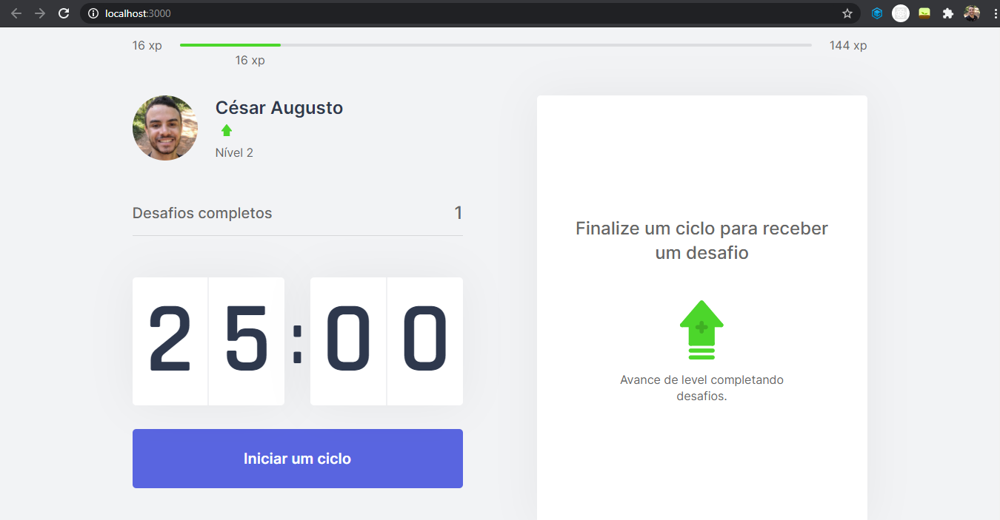
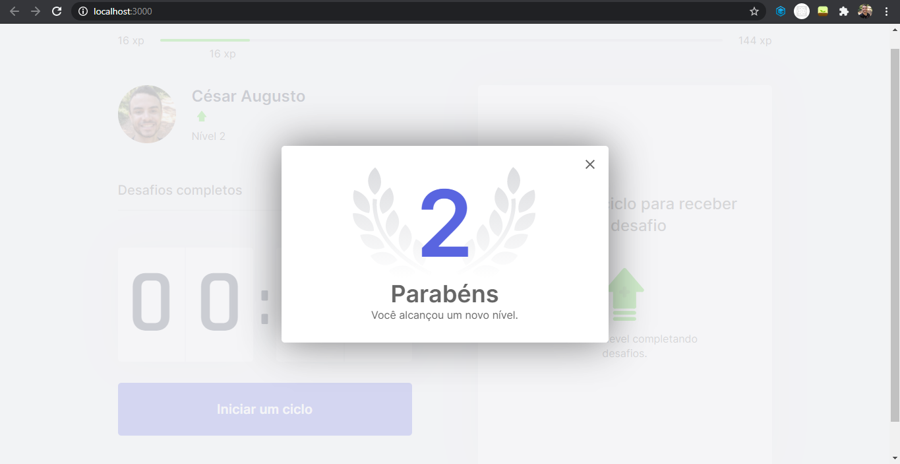
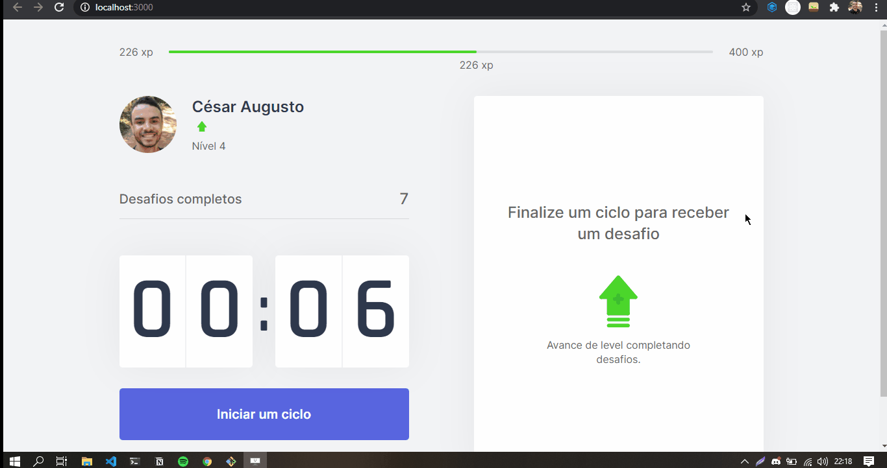

<div align="center">
  
</div>

<br>
<br>

<h1 align="center"> MoveIt </h1>

<div align="center">
Application built to improve the health of people who work all day on the computer.
<br>


" alt="license" />
</div>


<p align="center">
 <a href="#about">About</a> |
 <a href="#technologies">Technologies</a> |
 <a href="#run">How to run</a> |
 <a href="#license">License</a> |
 <a href="#autor">Autor</a>
</p>

<br/>

## The application
Application developed during the fourth edition of NLW to understand and know the benefits of the next JS. <br />
The objective when working with this application was to know several important concepts, mainly the React JS context api
## 💻 Preview
<div>
  
  
</div>
<div>
  
</div>

<br/>

<div id="about">

## 📎 Features
- [x] Count focus time
- [x] Complete challenges
- [x] Accumulate experience score

<br>

<div id="technologies">

## 🛠 Technologies
The following tools were used to solve this challenge:
- [Next JS](https://nextjs.org/)
- [React JS](https://pt-br.reactjs.org/)
- [TypeScript](https://www.typescriptlang.org/)

</div>

<br>

<div id="run">

## ℹ How to run

### Requirements

Before you start, you will need to install the following tools:
- [React JS](https://pt-br.reactjs.org/)
- [Yarn](https://yarnpkg.com)
- [Git](https://git-scm.com)

Clone the repository and install the dependencies:

```bash
# To clone the repository
$ git clone https://github.com/cesarramos95/moveit-nlw-04

# To acess the folder
$ cd moveit-nlw-04

# Installing all dependencies
$ yarn

```

To run the application:

```shell
$ yarn dev
```
</div>

<div id="license">

---

## 📝 License
This repository is under [MIT](./license) license.
</div>

<div id="autor">

## Autor


<br>
<a href="t.me/cesarramos95">César</a>

[](https://www.linkedin.com/in/cesararamos/)
[](mailto:cesarramos.aug@gmail.com)

</div>

---

Made with ❤ by César 👋 [Get in touch!](https://linkedin.com/in/cesararamos)

